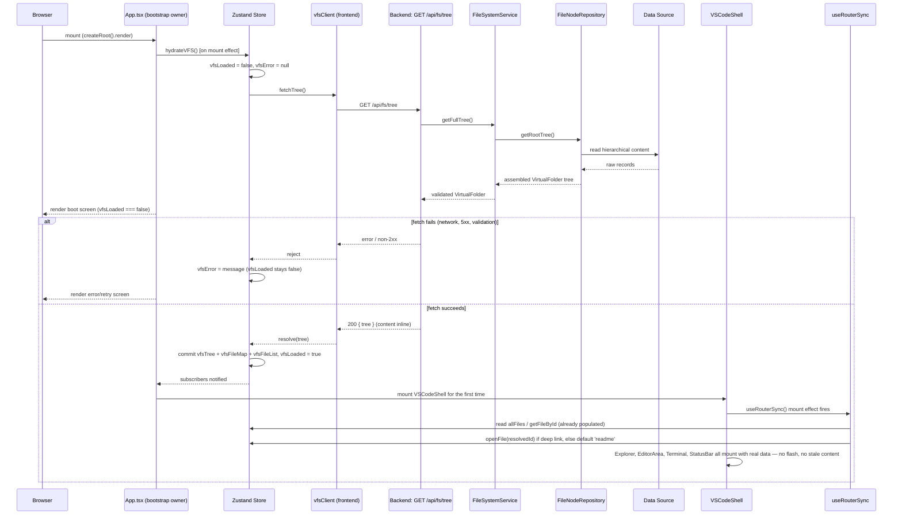
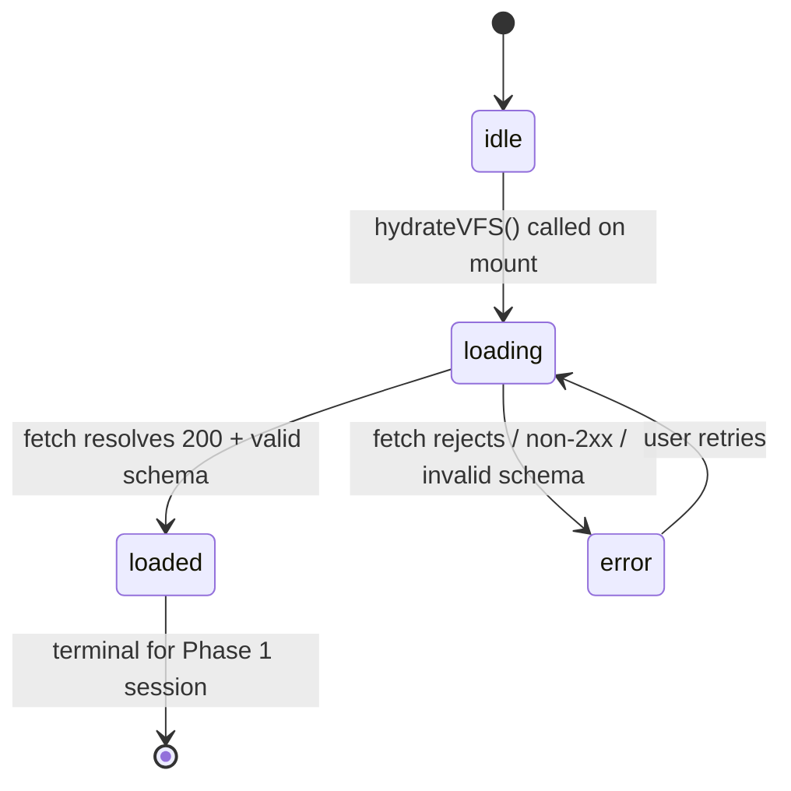

# Backend Bootstrap Guide

## Overview
This document outlines the required backend architecture designed to integrate seamlessly with the existing VS Code Portfolio frontend. The backend must replace the current static mock data while preserving the exact state structures and behaviors expected by the frontend's Zustand store.

This document is the **canonical backend implementation specification** for this project. It supersedes `ARCHITECTURE.md`, `CURRENT_STATE.md`, and `PROJECT_CONTEXT.md` on anything backend-related — those remain the source of truth for frontend structure and product vision, but where they touch backend integration, this document wins. It reflects every architecture decision made through the review sessions culminating 2026-07-12, most importantly: **the Virtual File System (VFS) is being built first**, because it is the only API whose schema is already frozen by existing frontend types, and because Terminal and Search (the two hard dependents) cannot be correctly implemented without it.

## Implementation Phasing
Not everything below is being built now. This spec covers all planned backend surface area, but only Phase 1 is authorized for implementation at this time — do not start Phase 2/3 work without separate approval, per the incremental, one-feature-at-a-time working agreement for this project.

| Phase | Scope | Status |
|---|---|---|
| **Phase 1** | VFS API (`GET /api/fs/tree` only), store hydration, bootstrap gate | Canonical, ready to implement |
| **Phase 2** | Terminal Engine API, `GET /api/fs/file/:id`, `PUT /api/fs/file/:id` | Designed below, not yet approved |
| **Phase 3** | Search Engine, GitHub/LeetCode Integrations, Notification Engine | Designed below, not yet approved |

---

## Ownership of Responsibilities
Each concern has exactly one owner. This split exists specifically to satisfy Single Responsibility — no file does more than one of these jobs.

| Owner | Responsibility | Does NOT do |
|---|---|---|
| `App.tsx` (frontend) | Bootstrap orchestration: triggers hydration on mount, renders boot screen / error screen / `VSCodeShell` based on store flags | Fetching, parsing, or shaping VFS data |
| Zustand store (`useStore.ts`) | Owns VFS state (`vfsTree`, `vfsFileMap`, `vfsFileList`, `vfsLoaded`, `vfsError`) and the `hydrateVFS()` action — single source of truth | HTTP calls, response parsing |
| `vfsClient` (new, frontend) | HTTP I/O only — `fetchTree(): Promise<VirtualFolder>` | State management, retries/backoff logic, rendering |
| `fileSystem.ts` (frontend) | Backward-compatible **read facade** — `fileSystem`, `allFiles`, `getFileById` keep their exact existing names/signatures but read from the store instead of a hardcoded literal | Owning any state itself |
| API route layer (backend) | HTTP contract enforcement: request validation, status codes, error response shape | Business logic, data access |
| `FileSystemService` (backend) | Business logic: assembles the tree, enforces the `VirtualFile`/`VirtualFolder` schema | Talking to the database/filesystem directly |
| `FileNodeRepository` (backend) | Data access abstraction — hides whether data comes from Postgres, Mongo, or flat files | HTTP concerns, schema validation |

This ownership split is also why the frontend migration requires touching only a handful of files even though ten components import from `fileSystem.ts` today: none of those ten need to change, because the facade absorbs the change in data source.

---

## Startup Lifecycle
End-to-end, from process start to an interactive IDE, spanning both sides of the stack.

**Backend:**
1. Process starts, loads configuration (data source connection string / file path).
2. `FileNodeRepository` establishes its data source connection (or confirms local content is readable).
3. HTTP server binds and starts listening. The backend is expected to be running and reachable at a known base URL (via env var, see `.env.example`) *before* the frontend is loaded — the frontend does not manage backend lifecycle.

**Frontend:**
1. Browser requests the page; `main.tsx` mounts `<App />`.
2. `App` enters the `idle` hydration state and immediately triggers `hydrateVFS()` (see Hydration Lifecycle below).
3. While hydration is in flight, `App` renders a boot screen. **No other component in the tree mounts yet** — this is a hard gate, not a soft loading flag threaded through props.
4. On successful hydration, `App` mounts `VSCodeShell` for the first time. Everything downstream (`useRouterSync`, `Explorer`, `EditorArea`, `Terminal`, `StatusBar`, `CommandPalette`) mounts with real data on its very first render.
5. The application is now interactive.

This single hard gate is what eliminates the two regressions identified during review: `useRouterSync`'s deep-link race (it now only ever runs after data exists) and `ShikiEditor`'s stale-content bug (it now only ever mounts after its file is resolvable).

---

## Bootstrap Flow (Frontend Mechanics)
What actually happens inside `App.tsx`:
1. On mount, call the store's `hydrateVFS()` action. Do not inline fetch logic in `App.tsx` — it only reads `vfsLoaded` / `vfsError` and calls the action.
2. Render branch:
   - `vfsLoaded === false && vfsError === null` → boot screen.
   - `vfsError !== null` → error screen with a retry action that re-invokes `hydrateVFS()`.
   - `vfsLoaded === true` → `<VSCodeShell />`.
3. No other bootstrap responsibility belongs in `App.tsx`. It is intentionally the thinnest possible orchestration layer.

---

## Hydration Lifecycle
The lifecycle of VFS data specifically, independent of which component is watching it:
1. **Request initiation** — `hydrateVFS()` is called exactly once per app load (plus once per manual retry after a failure). It is not polled and not re-triggered on navigation.
2. **In-flight** — `vfsLoaded = false`, `vfsError = null`. `vfsTree` / `vfsFileMap` / `vfsFileList` remain at their initial empty values.
3. **Resolution** —
   - Success: the full `VirtualFolder` tree is committed to the store **atomically** (see Store Hydration Flow) and `vfsLoaded` flips to `true` in the same update.
   - Failure: `vfsError` is set to a message, `vfsLoaded` stays `false`. The store is never left in a partially-populated state — a failed hydration commits nothing.
4. **Terminal state (Phase 1)** — once `vfsLoaded === true`, the VFS data is not re-fetched again during the session. There is no background refresh, polling, or invalidation in Phase 1. (This changes once `PUT /api/fs/file/:id` exists in Phase 2 — see Future Extension Points.)

**Design decision — content is inline, not lazy:** `GET /api/fs/tree` returns full file content for every node in one response, matching the shape the frontend already expects everywhere it reads `file.content` synchronously. Lazy per-file content loading (`GET /api/fs/file/:id`) is explicitly deferred — see Future Lazy-Loading Migration Strategy.

---

## Store Hydration Flow
New state and the one new action added to `useStore.ts`:

**New state fields:**
- `vfsTree: VirtualFolder | null` — the raw tree, used by `Explorer`.
- `vfsFileMap: Record<string, VirtualFile>` — flat lookup, backs `getFileById`.
- `vfsFileList: VirtualFile[]` — flat ordered array (same traversal order as the existing `getAllFiles()` helper), backs `allFiles`.
- `vfsLoaded: boolean` — default `false`.
- `vfsError: string | null` — default `null`.

**New action — `hydrateVFS()`:**
1. Guard: no-op if already loading (prevents duplicate in-flight requests from a double-invoked effect, e.g. React StrictMode's double-mount in development).
2. Set `vfsError = null`.
3. Call `vfsClient.fetchTree()`.
4. On resolve: derive `vfsFileMap` / `vfsFileList` from the returned tree using the existing `getAllFiles()` traversal logic (reused, not reimplemented), then commit `vfsTree`, `vfsFileMap`, `vfsFileList`, and `vfsLoaded = true` in a single `set()` call — this is the "atomic commit" referenced above.
5. On reject: `vfsError = <error message>`. `vfsLoaded` remains `false`.

`fileSystem.ts`'s facade functions read these fields directly (`getFileById(id)` → `useStore.getState().vfsFileMap[id]`, `allFiles` → `useStore.getState().vfsFileList`, `fileSystem` → `useStore.getState().vfsTree`), preserving their existing call signatures for all ten current importers.

---

## Sequence Diagram
Spans backend and frontend, since both must be implemented against this contract.



---

## State Machine
The hydration lifecycle as an explicit state machine — this is what `App.tsx`'s render branch is switching on.



`loaded` is terminal for the remainder of the session in Phase 1 — there is no `loaded → loading` transition triggered by anything other than a full page reload. Phase 2's `PUT /api/fs/file/:id` mutates store state directly on success rather than re-entering this state machine (see Error Handling Strategy for how save failures are handled differently from hydration failures).

---

## Required APIs

### 1. Virtual File System (VFS) API — Phase 1
- **`GET /api/fs/tree`**
  - Returns the entire nested directory structure, **with file content inline** (see Hydration Lifecycle for why this is a deliberate Phase 1 decision, not an oversight).
  - Required schema: matches `VirtualFolder` and `VirtualFile` interfaces exactly (see API Contracts below).
- **`GET /api/fs/file/:id`** *(Phase 2 — not implemented yet)*
  - Returns the specific content for a file. Only becomes necessary once the lazy-loading migration (below) is triggered.
- **`PUT /api/fs/file/:id`** *(Phase 2 — not implemented yet)*
  - Saves updates to a file's content (clearing the frontend's "dirty" state).

### 2. Terminal Engine API — Phase 2
- **`POST /api/terminal/execute`**
  - Body: `{ command: string, cwd: string }`
  - Returns: `{ output: string, newCwd?: string, error?: boolean }`
  - Purpose: Processes terminal commands dynamically instead of relying on frontend switch statements.

### 3. Integration APIs (Stats & Notifications) — Phase 3
- **`GET /api/integrations/github`**
  - Returns live commit history, active streaks, or PR counts.
- **`GET /api/integrations/leetcode`**
  - Returns solved problem counts and current streak.
- **`GET /api/notifications/poll`** (or WebSocket setup)
  - Pushes real-time alerts to the frontend notification engine.

---

## API Contracts (VFS — Phase 1)

### `GET /api/fs/tree`

**Success — `200`:**
```json
{
  "id": "root",
  "name": "Journey",
  "path": "/",
  "children": [
    {
      "id": "readme",
      "name": "README.md",
      "type": "markdown",
      "path": "/README.md",
      "content": "# Welcome to my Journey\n..."
    },
    {
      "id": "about",
      "name": "about",
      "path": "/about",
      "children": [ /* ... */ ]
    }
  ]
}
```

**Discrimination contract — read this carefully:** the frontend distinguishes a file from a folder with `'content' in node`, not an explicit `type` field at the container level. This means:
- Folder nodes must **never** include a `content` key (not even `null` or `""`) — its presence, of any value, will make the frontend treat the folder as a file.
- File nodes must **always** include `content` (an empty file is `content: ""`, not an omitted key) and a `type` matching one of the frontend's `FileType` union: `'markdown' | 'typescript' | 'python' | 'json' | 'yaml' | 'toml' | 'shell' | 'mermaid' | 'tsx'`. An unrecognized `type` string will not crash the frontend but will fall through to `FileIconMap.default` in every icon-rendering component and to the raw `ShikiEditor` renderer.
- `id` must be unique across the **entire tree**, not just per-folder — it's used as the global lookup key in `vfsFileMap` and as React `key` props throughout the Explorer/tabs/breadcrumbs.
- `path` must be consistent with `id`-based lookups used by `useRouterSync`'s URL-resolution logic (see `src/hooks/useRouterSync.ts` for the exact suffix-matching rules it applies).

**Failure — `5xx` or network error:**
Any non-2xx response or network failure is treated identically by `vfsClient`: reject the promise with a message string. No partial/degraded success mode exists for this endpoint — it's all-or-nothing by design (see Error Handling Strategy).

---

## Required Services

### 1. FileSystem Service — Phase 1
- Responsible for reading/writing the portfolio's content data.
- Determines if data is read from a database (e.g., PostgreSQL/MongoDB) or from a local folder structure on the server.
- **Service responsibilities, made explicit:**
  - `getFullTree(): VirtualFolder` — assembles the complete tree via `FileNodeRepository`, enforces the discrimination contract above (no accidental `content` keys on folders, no missing `content` on files), and is the single place that validates the response shape before it leaves the backend.
  - Owns no HTTP concerns — the route handler is what turns a thrown domain error into a status code.
  - In Phase 1, this service has exactly one consumer (`GET /api/fs/tree`) and exactly one method. Do not add `getFileById`/`searchFiles` methods to this service ahead of Phase 2/3 — that's premature scope; those belong to `FileNodeRepository` directly when their endpoints are actually built.

### 2. Terminal Service — Phase 2
- A command parser and execution environment.
- Needs a safe, sandboxed environment if allowing real execution, or a robust mock engine that simulates an OS environment (maintaining session state, environment variables, and CWD).

### 3. Integration Service — Phase 3
- Background workers or cron jobs that periodically fetch data from GitHub and LeetCode APIs to prevent rate-limiting and ensure fast frontend responses.

---

## Repository Layer

### `FileNodeRepository` — Phase 1 (partial)
- Manages the hierarchical structure of the workspace.
- **Required Methods**:
  - `getRootTree()`: Fetch the base structure. **This is the only method Phase 1 requires.**
  - `getFileById(id)`: Fetch content. *(Phase 2 — backs `GET /api/fs/file/:id`)*
  - `searchFiles(query)`: Search file names and contents. *(Phase 3 — backs the Search Engine)*
- **Repository responsibilities, made explicit:**
  - Hides the storage mechanism entirely from `FileSystemService` — swapping from flat files to Postgres later must not require changing the service or route layer, only this repository's implementation.
  - Owns no schema validation — it returns whatever shape its data source gives it; `FileSystemService` is responsible for confirming that shape matches `VirtualFolder`/`VirtualFile` before it's sent to a client.
  - Should not know about HTTP, Express/Fastify request objects, or response formatting.

---

## Core Engines

### Search Engine — Phase 3
- Required for the Command Palette (`Cmd+K`).
- Initially, the frontend filters the static array. The backend should provide a `/api/search?q={query}` endpoint that uses full-text search (e.g., Postgres `tsvector` or Elasticsearch) to return matching `VirtualFile` records quickly.
- Depends on `FileNodeRepository` (see Repository Layer) — do not build a parallel search index outside the repository abstraction.

### Terminal Engine — Phase 2
- Must be stateful per session or handle state explicitly via JWT/session cookies to track the `cwd` (Current Working Directory).
- Standard commands to support: `ls`, `cd`, `cat`, `pwd`, `echo`, `help`.
- Portfolio-specific commands to support: `npm run about`, `open <file>`.
- Depends on `FileNodeRepository.getFileById()` / a future `listChildren()`-style method for `ls`/`cat`/`cd` to resolve against real data rather than duplicating file lookup logic outside the repository.

### Notification Engine — Phase 3
- The backend should generate system events.
- Should push JSON objects matching the frontend `Notification` interface:
  ```json
  {
    "id": "string",
    "source": "GitHub" | "LeetCode" | "System",
    "message": "string",
    "timestamp": 1234567890
  }
  ```

---

## Error Handling Strategy
Two distinct error categories exist, and they are **not** handled the same way — conflating them is a common mistake worth calling out explicitly:

1. **Hydration-time errors** (Phase 1, covered by this spec's state machine): the initial `GET /api/fs/tree` fails. This is blocking and application-wide — nothing in `VSCodeShell` can render meaningfully without this data, so `App.tsx` shows a full error/retry screen. There is no partial-tree fallback.
2. **Per-file save errors** (Phase 2, `PUT /api/fs/file/:id`): once implemented, a failed save is a **local, non-blocking** failure — it must not reset `vfsLoaded` or unmount the shell. It should surface through the existing `Notification` system (`addNotification`) so the rest of the IDE stays usable while the user retries the save.

Backend-side, both categories share one rule: **domain errors thrown by `FileNodeRepository`/`FileSystemService` should be typed** (e.g., a `FileNotFoundError`), and only the route/API layer translates them into HTTP status codes and a consistent JSON error body (`{ "error": string }`). Repositories and services must never construct HTTP responses themselves — that would violate the ownership split above and make the repository layer untestable without an HTTP context.

---

## Loading Strategy
Phase 1 uses **one application-level loading gate**, not per-component skeleton/loading states. `App.tsx` is the only component with loading-state awareness; `Explorer`, `EditorArea`, `Terminal`, etc. are written as if data is always present, because structurally it always is by the time they mount.

**Why this over per-component skeletons:** a boot screen fits the "authentic IDE" illusion this portfolio is built around (analogous to VS Code's own startup splash) better than several independent spinners assembling piecemeal — which would look like a website loading, not an application starting. It also structurally eliminates the two race conditions found during review (see Startup Lifecycle) rather than requiring each component to defensively handle an undefined-data case.

**This strategy is Phase-1-specific.** It is intentionally revisited when lazy loading is introduced — see below.

---

## Future Lazy-Loading Migration Strategy
`GET /api/fs/file/:id` and per-file loading states are deferred, not rejected. Trigger condition: file content payloads grow large enough (e.g., large generated READMEs, embedded diagrams) that shipping every file's full content in one `GET /api/fs/tree` response is no longer acceptable for initial load time.

When that trigger is hit, the migration is:
1. Add `GET /api/fs/file/:id` (already designed above, just not built).
2. Change the tree payload contract: file nodes may omit `content` (or send an empty string) for files not needed at bootstrap; the discrimination-by-`'content' in node'` contract must be revisited at this point since an "omitted content" file would misclassify as a folder under the current rule — this needs an explicit decision (e.g., switch to a `type: 'file' | 'folder'` discriminator) before lazy loading ships.
3. Update the store's `openFile` action to fetch content on demand when a file without cached content is opened, and track a per-file `isContentLoaded` flag.
4. **Required at this point, not before:** fix `ShikiEditor.tsx`'s content-seeding `useEffect` dependency array — currently `[fileId]`, must become `[fileId, file]` (or equivalent). This bug is inert today only because the Phase 1 hard-gate guarantees `file.content` is always present the instant a file is resolvable; lazy loading reintroduces exactly the "file arrives asynchronously after the component already mounted" scenario this bug requires to manifest.
5. Add a per-tab loading indicator in `EditorRenderer`/`ShikiEditor` for the window between "tab opened" and "content arrived."

---

## Design Tradeoffs
Explicit record of decisions made and what was given up, so a future engineer doesn't "fix" something that was deliberate:

| Decision | Alternative considered | Why this one |
|---|---|---|
| Full content inline in `GET /api/fs/tree` | Lazy per-file fetch from day one | Every existing frontend consumer reads `file.content` synchronously with no loading state; lazy-from-day-one would force editing all of them now. Deferred until payload size actually forces it. |
| Single app-level boot gate | Per-component loading states / skeletons | Structurally eliminates the `useRouterSync` race and the `ShikiEditor` stale-content bug instead of patching each one; also fits the IDE illusion better than piecemeal spinners. Cost: a blank boot screen on slow networks instead of a partially-interactive shell. |
| VFS state lives in the Zustand store | Module-level mutable variable in `fileSystem.ts`, reassigned after fetch | Nearly every component already subscribes to the *entire* store (`useStore()` with no selector), so routing hydration through the store makes re-rendering automatic and explicit. A bare module reassignment wouldn't trigger React re-renders at all in components that read the module directly (e.g. `Explorer`, `CommandPalette`), and relying on other components' *incidental* full-store subscriptions to force a re-render would be fragile — it would silently break the moment anyone optimizes a component to use a selector. |
| `fileSystem.ts` kept as a same-signature facade | Migrate all ten importers to call the store directly | Minimizes frontend change surface to near-zero, consistent with "never rewrite existing frontend unless explicitly asked" and "avoid large refactors." |

---

## Technical Debt
Carried forward from `ARCHITECTURE.md`/`CURRENT_STATE.md`, plus items surfaced during this review. None of these block Phase 1 — listed so they aren't mistaken for accidental omissions.

- **Monolithic store, unselected subscriptions** (pre-existing): every component calls `useStore()` without a selector, so any store mutation re-renders the entire tree. Phase 1's hydration mechanism actually depends on this behavior (see Design Tradeoffs), but it should eventually move to selector-based subscriptions for performance — at which point hydration's re-render trigger needs to be re-verified, not assumed.
- **Hardcoded path-resolution fallback rules** in `useRouterSync.ts` (pre-existing) — breaks if the file tree structure changes without also updating these string-suffix rules.
- **Unused imports**: `getFileById` is imported but never called in `Explorer.tsx` and `EditorArea.tsx`; `getFileByPath` is exported from `fileSystem.ts` but has zero importers anywhere. Safe cleanup, intentionally out of scope for this phase (avoid touching unrelated files).
- **`ShikiEditor.tsx` stale-content effect dependency** (`[fileId]` instead of `[fileId, file]`) — inert under the Phase 1 hard gate, becomes a required fix before the lazy-loading migration (see above).
- **`WorkHistoryViewer.tsx` hardcodes a `jobs` array** separately from the `work_history.ts` file content it renders alongside — dynamic parsing from actual file content deferred (pre-existing, noted in `CURRENT_STATE.md`).

---

## Future Extension Points
- **Terminal Engine API** (`/api/terminal/execute`) — once Phase 1 is stable and approved to proceed.
- **Search Engine API** for Command Palette, replacing the client-side `.filter()` over `allFiles`.
- **GitHub/LeetCode Integration services** + **Notification Engine** (poll or WebSocket).
- **`PUT /api/fs/file/:id` save flow**, wiring into `ShikiEditor`'s existing dirty-state indicator (`setFileDirty`) so saves actually clear it instead of it being purely local/simulated.
- **Session/JWT-based Terminal statefulness** for real `cwd` tracking, replacing the current hardcoded `pwd`/`cd` output in `Terminal.tsx`.
- **`type: 'file' | 'folder'` discriminator** on VFS nodes — likely needed before lazy loading ships (see Future Lazy-Loading Migration Strategy), would replace the current implicit `'content' in node'` discrimination contract.

---

## Integration Map
When booting the backend, wire the endpoints directly into these existing frontend files:
1. `src/content/fileSystem.ts` → becomes a **read facade**: `fileSystem`, `allFiles`, and `getFileById` keep their existing exported names and call signatures, but read from the Zustand store's `vfsTree`/`vfsFileList`/`vfsFileMap` instead of a hardcoded literal. This is why none of its ten current importers need to change.
2. `src/components/terminal/Terminal.tsx` → Swap `handleCommand` logic for `fetch('/api/terminal/execute')`. *(Phase 2)*
3. `src/components/command-palette/CommandPalette.tsx` → Use backend search API. *(Phase 3)*
4. `src/store/useStore.ts` → Add `vfsTree`/`vfsFileMap`/`vfsFileList`/`vfsLoaded`/`vfsError` state and the `hydrateVFS()` action (see Store Hydration Flow). *(Phase 1)*
5. `src/App.tsx` → Becomes the bootstrap gate: triggers `hydrateVFS()` on mount, renders boot/error/shell based on store flags (see Bootstrap Flow). *(Phase 1, new integration point not in the original map)*

---

## Implementation Sprints
Numbered, sequential milestones. Each one is a single reviewable unit of work — per the project's working agreement, do not start milestone *N+1* until milestone *N* has been reviewed and approved. Milestones 1–5 cover Phase 1 (authorized). Milestones 6–9 cover Phase 2/3 (design-only until separately approved) and are included here so the full roadmap is visible, not as a green light to start them.

The repo currently has `express`, `@types/express`, `dotenv`, and `esbuild` already installed with a `clean` script that removes `server.js` — this implies a single-entrypoint Express backend bundled to `server.js` was already the intended shape before this planning work began. The milestones below build toward that, under a new `server/` directory (does not exist yet).

### Milestone 1 — Backend Scaffold & Health Check
- **Objective**: Stand up a minimal Express + TypeScript backend process, independently of any VFS logic, and prove it boots and is reachable.
- **Scope**: Server entrypoint, config/env loading, one trivial `GET /api/health` route returning `{ "status": "ok" }`. No repository, service, or VFS logic yet.
- **Dependencies**: None — first milestone.
- **Files expected to change**: New `server/index.ts`, new `server/routes/health.routes.ts`; `package.json` (add a `dev:server`/`start` script); `.env.example` (add backend port/base-URL vars, remove the stale AI-Studio-specific vars if confirmed unused).
- **Acceptance criteria**: `npm run dev:server` starts the process without errors; `GET /api/health` returns `200 { "status": "ok" }`; existing `npm run dev` / `npm run build` for the frontend remain fully unaffected.
- **Review checkpoint**: Confirm the server boots and is reachable in isolation before any business logic is written on top of it.

### Milestone 2 — FileNodeRepository + FileSystemService + `GET /api/fs/tree` (backend-only)
- **Objective**: Implement real VFS data assembly and expose it over HTTP, fully satisfying the API Contract already specified above — without touching the frontend at all.
- **Scope**: `FileNodeRepository.getRootTree()` backed by a seed dataset migrated 1:1 from `src/content/fileSystem.ts`'s current tree (so the response is schema-equivalent to what the frontend already renders — swapping the seed for a real database is explicitly out of scope here); `FileSystemService.getFullTree()` enforcing the discrimination contract (no stray `content` key on folders, `content` always present on files); the `GET /api/fs/tree` route wired to the service, with domain errors translated to `5xx` + `{ "error": string }`.
- **Dependencies**: Milestone 1.
- **Files expected to change**: New `server/repositories/FileNodeRepository.ts`, `server/services/FileSystemService.ts`, `server/routes/fs.routes.ts`, a seed data file, and a shared types location (decide during this milestone whether the backend imports `src/types/index.ts` directly or a new `shared/types.ts` is introduced — this is an open question to resolve here, not before).
- **Acceptance criteria**: `curl /api/fs/tree` returns a tree matching the API Contracts section exactly, schema-equivalent to today's `getAllFiles(fileSystem)` output; a deliberately induced repository failure produces a structured `5xx` response, not an unhandled crash.
- **Review checkpoint**: Verify contract compliance (discrimination rule, id uniqueness, `FileType` validity) manually before any frontend wiring begins — schema drift caught here is far cheaper than catching it after Milestone 4.

### Milestone 3 — Frontend `vfsClient` + Store Hydration State (no UI wiring yet)
- **Objective**: Add the frontend plumbing that will consume Milestone 2's endpoint, without changing what any component currently renders.
- **Scope**: `vfsClient.fetchTree()`; new store fields (`vfsTree`, `vfsFileMap`, `vfsFileList`, `vfsLoaded`, `vfsError`) and the `hydrateVFS()` action, exactly as specified in Store Hydration Flow. Verified via manual invocation (browser console / a throwaway script), not by wiring into `App.tsx` yet — keeping this milestone isolated makes it independently reviewable.
- **Dependencies**: Milestone 2.
- **Files expected to change**: New `src/api/vfsClient.ts`; `src/store/useStore.ts` (new fields and action only — no existing action or consumer touched).
- **Acceptance criteria**: Manually calling `useStore.getState().hydrateVFS()` against the running backend results in `vfsLoaded === true` with `vfsFileMap`/`vfsFileList` populated from the real tree; stopping the backend and retrying results in `vfsError` being set and `vfsLoaded` staying `false`; no existing component's behavior changes, since nothing reads these fields yet.
- **Review checkpoint**: Confirm both the success path and the failure path of the store action work correctly before anything in the render tree starts depending on them.

### Milestone 4 — `fileSystem.ts` Facade Conversion
- **Objective**: Make all ten existing frontend consumers start reading real backend data, with zero changes to those ten files.
- **Scope**: Rewrite `fileSystem.ts` internals only — `fileSystem`, `allFiles`, `getFileById` become read functions over the Milestone 3 store fields, preserving their exact exported names and signatures. Remove the hardcoded literal tree.
- **Dependencies**: Milestone 3.
- **Files expected to change**: `src/content/fileSystem.ts` only.
- **Acceptance criteria**: With the backend running, manually triggering `hydrateVFS()` from the console causes already-mounted consumers (e.g. `Explorer`, `CommandPalette`) to re-render with real data; `npm run lint` (TypeScript check) passes with no consumer file modified.
- **Review checkpoint**: This is the highest-regression-risk milestone per the earlier per-consumer audit — review must specifically re-verify `Explorer` and `CommandPalette` (the two components reading module state directly during render) actually re-render on hydration, not just that the app compiles.

### Milestone 5 — `App.tsx` Bootstrap Gate (Phase 1 complete)
- **Objective**: Wire hydration into real app startup, completing the Startup Lifecycle and State Machine as designed above.
- **Scope**: `App.tsx` triggers `hydrateVFS()` on mount and switches between boot screen / error+retry screen / `<VSCodeShell />` per the state machine; a minimal boot screen and error screen, styled consistent with the IDE aesthetic rather than a generic spinner.
- **Dependencies**: Milestones 3 and 4.
- **Files expected to change**: `src/App.tsx`; new `src/components/shell/BootScreen.tsx` (or equivalent).
- **Acceptance criteria**: A full page load against the live backend shows a brief boot screen, then a fully interactive IDE with real content — no flash of an empty Explorer or blank editor tabs; killing the backend before load shows the error/retry screen, and retrying after restarting the backend proceeds correctly; a cold-load deep link to `/journey/about` opens the correct file (this specifically validates the `useRouterSync` race fix, not just the happy path).
- **Review checkpoint**: Full manual walkthrough in a browser of both the golden path and the kill-backend/retry path before Phase 1 is declared done — this is the checkpoint where the entire VFS milestone chain gets signed off together.

---

*The milestones below are Phase 2/3 scope — included for roadmap visibility only. Do not start without separate approval, per Milestone 5's sign-off gating the next feature.*

### Milestone 6 — Terminal Engine API *(Phase 2)*
- **Objective**: Replace `Terminal.tsx`'s local `switch` statement with `POST /api/terminal/execute`.
- **Scope**: `TerminalService` + route handler; session/`cwd` handling per the Core Engines section.
- **Dependencies**: Milestone 2 (`FileNodeRepository` needed to resolve `ls`/`cat`/`cd` against real data).
- **Files expected to change**: New `server/services/TerminalService.ts`, `server/routes/terminal.routes.ts`; `src/components/terminal/Terminal.tsx`.
- **Acceptance criteria**: Full parity with today's hardcoded command set (`help`, `ls`, `open`, `cat`, `npm run`, `cd`, `pwd`) via the new endpoint — no regression in any documented command's output.
- **Review checkpoint**: Side-by-side comparison of old vs. new output for every command currently supported in `Terminal.tsx`.

### Milestone 7 — Lazy File Content: `GET`/`PUT /api/fs/file/:id` *(Phase 2)*
- **Objective**: Implement the Future Lazy-Loading Migration Strategy — only if/when the payload-size trigger described there is actually hit.
- **Scope**: Repository/service methods for single-file read and write; routes; `openFile` store action updated to fetch-on-demand; the `ShikiEditor` dependency-array fix flagged as required-at-this-point tech debt.
- **Dependencies**: Milestone 2.
- **Files expected to change**: `server/repositories/FileNodeRepository.ts`, `server/routes/fs.routes.ts`; `src/store/useStore.ts`; `src/components/editor/ShikiEditor.tsx`.
- **Acceptance criteria**: Opening a file whose content wasn't included in the initial tree correctly lazy-loads and displays it; `ShikiEditor` no longer freezes on stale/empty content for a file opened before its data arrives.
- **Review checkpoint**: Explicitly verify the `ShikiEditor` dependency-array fix landed and is covered by a manual reproduction of the old bug — this is the one milestone where a previously-documented latent bug must be confirmed fixed, not just newly-written code reviewed.

### Milestone 8 — Search Engine API *(Phase 3)*
- **Objective**: Move Command Palette search server-side.
- **Scope**: `FileNodeRepository.searchFiles(query)`; `GET /api/search` route; `CommandPalette.tsx` wiring.
- **Dependencies**: Milestone 2.
- **Files expected to change**: `server/repositories/FileNodeRepository.ts`, `server/routes/search.routes.ts`; `src/components/command-palette/CommandPalette.tsx`.
- **Acceptance criteria**: At minimum, parity with the current client-side `.filter()` behavior; no added latency perceptible in the `Cmd+K` UX.
- **Review checkpoint**: Manual comparison of search result sets against the current client-side filter for a representative set of queries.

### Milestone 9 — GitHub/LeetCode Integrations + Notification Engine *(Phase 3)*
- **Objective**: Replace hardcoded notifications and status data with live integration data.
- **Scope**: `IntegrationService` with background/cron-based refresh (not per-request, to respect rate limits); notification delivery mechanism (poll or WebSocket, per Core Engines); wiring into `StatusBar`/`Notifications`.
- **Dependencies**: Milestone 1 only — independent of the VFS work.
- **Files expected to change**: New `server/services/IntegrationService.ts`, `server/routes/integrations.routes.ts`, `server/routes/notifications.routes.ts`; `src/store/useStore.ts`; `src/components/notifications/Notifications.tsx`.
- **Acceptance criteria**: Real GitHub/LeetCode data replaces the hardcoded `notifications` array in `useStore.ts`; no external API rate-limit violations under a normal browsing session; external API outages degrade gracefully (must not block app boot — this stays independent of the `vfsLoaded` gate).
- **Review checkpoint**: Verify graceful degradation specifically — simulate a GitHub/LeetCode API failure and confirm the rest of the IDE remains fully usable.
